# 🎯 Portfolio Backend API

> 다양한 미니 프로젝트들을 통한 Spring Boot 기술 스택 학습 및 실전 역량 강화

[](https://github.com/sky7214sky72/portfolio/actions/workflows/gradle.yml)
[](https://openjdk.org/)
[](https://spring.io/projects/spring-boot)
[](https://www.postgresql.org/)

---

## 📋 목차
- [프로젝트 소개](#-프로젝트-소개)
- [주요 기능](#-주요-기능)
- [기술 스택](#-기술-스택)
- [아키텍처](#-아키텍처)
- [시작하기](#-시작하기)
- [모니터링](#-모니터링)
- [CI/CD](#-cicd)

---

## 🎨 프로젝트 소개

실무 중심의 학습을 위한 멀티 도메인 백엔드 서비스입니다.
Spring Boot 생태계의 다양한 기술을 활용하여 **영단어 학습**, **야구 통계 분석**, **로또 번호 예측**, **소셜 인증** 기능을 구현했습니다.

### 💡 개발 목표
- 도메인 주도 설계(DDD) 기반의 모듈화된 코드 구조
- Spring Security + JWT + OAuth2를 활용한 인증/인가 시스템
- QueryDSL을 통한 복잡한 동적 쿼리 처리
- Prometheus + Grafana + Loki를 활용한 실시간 모니터링
- GitHub Actions + Docker를 통한 자동화된 CI/CD 파이프라인

---

## 🚀 주요 기능

### 1️⃣ 영단어 학습 시스템 (Word)
- 단어 등록 및 조회 API
- 사용자별 암기 단어 관리
- QueryDSL 기반 동적 검색 및 페이징
- 사용자 인증 기반 개인화 학습 데이터

### 2️⃣ 야구 통계 분석 (Baseball)
- 타자/투수 스탯 계산 엔진
- OPS(On-base Plus Slugging) 자동 계산
- wRC(Weighted Runs Created) 고급 세이버메트릭스
- 리그별/팀별 통계 데이터 관리

### 3️⃣ 로또 번호 예측 (Lotto)
- 역대 로또 당첨번호 수집 및 분석
- 통계 기반 번호 추천 알고리즘
- **스케줄러 기반 자동 데이터 수집** (매주 월요일)
- 회차별 당첨 번호 조회 API

### 4️⃣ 소셜 로그인 (OAuth2)
- 카카오/네이버/구글 소셜 로그인 통합
- JWT 기반 토큰 인증/갱신
- 커스텀 권한 어노테이션 (@AdminAuthorize, @UserAuthorize)
- OAuth2 Client 추상화 설계

---

## 🛠 기술 스택

### Backend
- **Java 17** - Modern Java features
- **Spring Boot 3.2.1** - 최신 Spring 생태계
- **Spring Data JPA** + **QueryDSL 5.1.0** - 타입 안전 쿼리
- **Spring Security** + **JWT** + **OAuth2 Client** - 인증/인가
- **PostgreSQL** - Production DB
- **H2** - Test DB

### DevOps & Monitoring
- **Docker** + **Docker Compose** - 컨테이너화
- **GitHub Actions** - CI/CD 자동화
- **Prometheus** - 메트릭 수집
- **Grafana** - 대시보드 시각화
- **Loki** + **Promtail** - 로그 수집/분석

### Tools
- **Gradle** - 빌드 자동화
- **Swagger/OpenAPI 3.0** - API 문서 자동화
- **Jacoco** + **SonarQube** - 코드 커버리지 및 품질 분석
- **Lombok** - 보일러플레이트 코드 제거

---

## 🏗 아키텍처

### 모듈 구조
```
portfolio/
├── baseball/     # 야구 통계 도메인
├── word/         # 영단어 학습 도메인
├── lotto/        # 로또 예측 도메인
├── sign/         # 인증/OAuth 도메인
└── global/       # 공통 설정 및 보안
    ├── config/   # Spring 설정 (Security, QueryDSL, Swagger)
    ├── jwt/      # JWT 토큰 처리
    ├── exception/# 전역 예외 처리
    └── domain/   # 공통 엔티티 및 응답 형식
```

### 시스템 플로우

```mermaid
flowchart TD
    %% Global Nodes
    Client("Client (User)"):::external
    API("PortfolioApplication"):::entry
    Monitoring("Monitoring Tools (Prometheus, Grafana, Loki)"):::monitoring
    DB("Database (PostgreSQL / H2)"):::db
    DevOps("DevOps/Deployment"):::devops
    Global("Global Config & Security<br/>(Config, Exception, JWT)"):::global

    %% Entry Relationships
    Client -->|"request"| API
    API -->|"initializes"| Global

    %% Word Module Subgraph
    subgraph "Word Module"
        WordCtrl("WordController"):::controller
        WordServ("WordService"):::service
        WordRepo("WordRepository"):::repository
        WordDom("Word Domain"):::domain
    end
    API -->|"routes"| WordCtrl
    WordCtrl -->|"calls"| WordServ
    WordServ -->|"persists via"| WordRepo
    WordServ -->|"uses"| WordDom
    WordRepo -->|"reads/writes"| DB

    %% Baseball Module Subgraph
    subgraph "Baseball Module"
        BaseCtrl("BaseballController"):::controller
        StatServ("StatService"):::service
        BaseRepo("BaseballRepository"):::repository
        BaseDom("Baseball Domain<br/>(OpsCalculator, WrcCalculator)"):::domain
    end
    API -->|"routes"| BaseCtrl
    BaseCtrl -->|"calls"| StatServ
    StatServ -->|"persists via"| BaseRepo
    StatServ -->|"calculates with"| BaseDom
    BaseRepo -->|"reads/writes"| DB

    %% Lotto Module Subgraph
    subgraph "Lotto Module"
        LottoCtrl("LottoController"):::controller
        LottoServ("LottoService"):::service
        LottoRepo("LottoRepository"):::repository
        LottoSched("Lotto Scheduler"):::service
        LottoDom("Lotto Domain"):::domain
    end
    API -->|"routes"| LottoCtrl
    LottoCtrl -->|"calls"| LottoServ
    LottoServ -->|"persists via"| LottoRepo
    LottoServ -->|"schedules"| LottoSched
    LottoServ -->|"processes"| LottoDom
    LottoRepo -->|"reads/writes"| DB

    %% Sign Module Subgraph
    subgraph "Sign Module"
        SignCtrl("SignController"):::controller
        SignServ("SignService"):::service
        SignRepo("SignRepository"):::repository
        OAuthJWT("OAuth/JWT"):::security
        OAuthProv("OAuth Providers<br/>(Kakao, Naver, Google)"):::external
    end
    API -->|"routes"| SignCtrl
    SignCtrl -->|"calls"| SignServ
    SignServ -->|"persists via"| SignRepo
    SignServ -->|"handles"| OAuthJWT
    OAuthJWT -->|"integrates with"| OAuthProv
    SignRepo -->|"reads/writes"| DB

    %% Global integration to Modules (cross-cutting concerns)
    Global ---|"applies to"| WordServ
    Global ---|"applies to"| StatServ
    Global ---|"applies to"| LottoServ
    Global ---|"applies to"| SignServ

    %% Monitoring & DevOps relationships
    API ---|"metrics"| Monitoring
    API ---|"CI/CD triggers"| DevOps

    %% Click Events
    click API "https://github.com/sky7214sky72/portfolio/blob/master/src/main/java/org/example/portfolio/PortfolioApplication.java"
    click WordCtrl "https://github.com/sky7214sky72/portfolio/tree/master/src/main/java/org/example/portfolio/word"
    click BaseCtrl "https://github.com/sky7214sky72/portfolio/tree/master/src/main/java/org/example/portfolio/baseball"
    click LottoCtrl "https://github.com/sky7214sky72/portfolio/tree/master/src/main/java/org/example/portfolio/lotto"
    click SignCtrl "https://github.com/sky7214sky72/portfolio/tree/master/src/main/java/org/example/portfolio/sign"
    click Global "https://github.com/sky7214sky72/portfolio/tree/master/src/main/java/org/example/portfolio/global"
    click DevOps "https://github.com/sky7214sky72/portfolio/blob/master/.github"

    %% Styles
    classDef entry fill:#f9f,stroke:#333,stroke-width:2px;
    classDef controller fill:#add8e6,stroke:#000,stroke-width:1px;
    classDef service fill:#90ee90,stroke:#000,stroke-width:1px;
    classDef repository fill:#d3d3d3,stroke:#000,stroke-width:1px;
    classDef domain fill:#ffeb99,stroke:#000,stroke-width:1px;
    classDef global fill:#ffc0cb,stroke:#000,stroke-width:1px;
    classDef security fill:#ff9999,stroke:#000,stroke-width:1px;
    classDef external fill:#e6e6fa,stroke:#000,stroke-width:1px;
    classDef monitoring fill:#dda0dd,stroke:#000,stroke-width:1px;
    classDef db fill:#ffe4e1,stroke:#000,stroke-width:1px,stroke-dasharray: 4 2;
    classDef devops fill:#f0e68c,stroke:#000,stroke-width:1px;
```


---

## 🏃 시작하기

### 사전 요구사항
- **JDK 17** 이상
- **Gradle 8.5** 이상
- **Docker** + **Docker Compose** (선택사항)

### 로컬 실행

#### 1. 프로젝트 클론
```bash
git clone --recurse-submodules https://github.com/sky7214sky72/portfolio.git
cd portfolio
```

#### 2. 설정 파일 복사
```bash
./gradlew copyApplicationYml
./gradlew copyTestApplicationYml
```

#### 3. PostgreSQL 실행 (Docker Compose)
```bash
docker-compose up -d
```

#### 4. 애플리케이션 실행
```bash
./gradlew bootRun
```

#### 5. API 문서 확인
```
http://localhost:8080/swagger-ui/index.html
```

### Docker로 실행
```bash
# 빌드
./gradlew build
docker build -t portfolio-app .

# 실행
docker run -p 8080:8080 portfolio-app
```

---

## 📊 모니터링

### Prometheus + Grafana 대시보드
서버 헬스체크, JVM 메트릭, HTTP 요청 통계를 실시간으로 모니터링합니다.


### Loki 로그 집계
애플리케이션 로그를 중앙화하여 검색 및 분석이 가능합니다.


### 주요 메트릭
- **JVM 메모리 사용량** (Heap/Non-Heap)
- **HTTP 요청 처리량** (RPS, 응답시간)
- **데이터베이스 커넥션 풀** 상태
- **스케줄러 실행 이력** (Lotto Scheduler)

---

## 🔄 CI/CD

### GitHub Actions 파이프라인

#### 빌드 단계
1. **체크아웃** - 서브모듈 포함 소스코드 가져오기
2. **빌드** - Gradle 빌드 및 테스트 스킵 (`-x test`)
3. **Docker 이미지 빌드** - `openjdk:17` 기반 이미지 생성
4. **DockerHub 푸시** - 레지스트리에 이미지 업로드

#### 배포 단계
1. **Self-hosted Runner** - EC2 인스턴스에서 실행
2. **이미지 Pull** - 최신 이미지 다운로드
3. **기존 컨테이너 중지** - 무중단 배포 준비
4. **Docker Compose Up** - 새 컨테이너 시작

### 배포 트리거
- `master` 브랜치로 Push 시 자동 배포
- Pull Request 생성 시 빌드 검증

---

## 📂 프로젝트 구조

```
src/main/java/org/example/portfolio/
├── PortfolioApplication.java          # Main 클래스
├── baseball/                           # 야구 통계 모듈
│   ├── controller/
│   ├── domain/                         # OpsCalculator, WrcCalculator
│   ├── repository/
│   └── service/
├── word/                               # 영단어 학습 모듈
│   ├── controller/
│   ├── domain/
│   ├── repository/                     # QueryDSL 커스텀 리포지토리
│   └── service/
├── lotto/                              # 로또 예측 모듈
│   ├── controller/
│   ├── domain/
│   ├── repository/
│   ├── schedule/                       # 스케줄러
│   └── service/
├── sign/                               # OAuth2 인증 모듈
│   ├── controller/
│   ├── domain/
│   │   ├── client/                     # OAuth 클라이언트 추상화
│   │   └── authcode/
│   ├── infra/                          # Kakao/Naver/Google 구현
│   ├── repository/
│   └── service/
└── global/                             # 공통 모듈
    ├── config/                         # Security, QueryDSL, Swagger
    ├── jwt/                            # JWT 필터 및 Provider
    ├── exception/                      # 전역 예외 핸들러
    ├── annotation/                     # 커스텀 권한 어노테이션
    └── domain/                         # BaseTimeEntity, ApiResponse
```

---

## 🔐 보안 & 인증

### JWT 토큰 기반 인증
- **Access Token** - 15분 유효기간
- **Refresh Token** - 7일 유효기간
- 토큰 갱신 API 제공

### 커스텀 권한 어노테이션
```java
@AllAuthorize    // 모든 인증 사용자
@UserAuthorize   // 일반 사용자
@AdminAuthorize  // 관리자 권한
```

### OAuth2 소셜 로그인
- **카카오** - REST API 기반
- **네이버** - OAuth 2.0
- **구글** - Google Identity Platform

---

## 📊 테스트 & 품질 관리

### 테스트 도구
- **JUnit 5** - 단위 테스트
- **REST Assured** - API 통합 테스트
- **H2 Database** - 테스트용 인메모리 DB

### 코드 품질
- **Jacoco** - 코드 커버리지 측정
- **SonarQube** - 정적 코드 분석
- **Checkstyle** - 코딩 컨벤션 검증

---

## 📌 API 엔드포인트 예시

### Word API
```http
POST   /word              # 단어 등록
GET    /word              # 단어 목록 조회 (페이징, 검색)
GET    /word/{wordId}     # 단어 상세 조회
```

### Baseball API
```http
GET    /baseball/hitter   # 타자 통계 조회
GET    /baseball/pitcher  # 투수 통계 조회
POST   /baseball/stat     # 통계 계산 요청
```

### Lotto API
```http
GET    /lotto/{round}     # 회차별 당첨번호 조회
POST   /lotto/predict     # 번호 예측 생성
```

### Sign API
```http
GET    /oauth/{provider}  # 소셜 로그인 시작
POST   /oauth/token       # 토큰 발급
POST   /oauth/refresh     # 토큰 갱신
```

---

## 🤝 기여 가이드

1. Fork the Project
2. Create your Feature Branch (`git checkout -b feature/AmazingFeature`)
3. Commit your Changes (`git commit -m 'Add some AmazingFeature'`)
4. Push to the Branch (`git push origin feature/AmazingFeature`)
5. Open a Pull Request

---

## 📝 라이선스

This project is open source and available under the [MIT License](LICENSE).

---

## 📧 연락처

GitHub: [@sky7214sky72](https://github.com/sky7214sky72)

프로젝트 링크: [https://github.com/sky7214sky72/portfolio](https://github.com/sky7214sky72/portfolio)

---

<div align="center">

**Made with ❤️ by sky7214sky72**

*학습은 멈추지 않는다*

</div>
